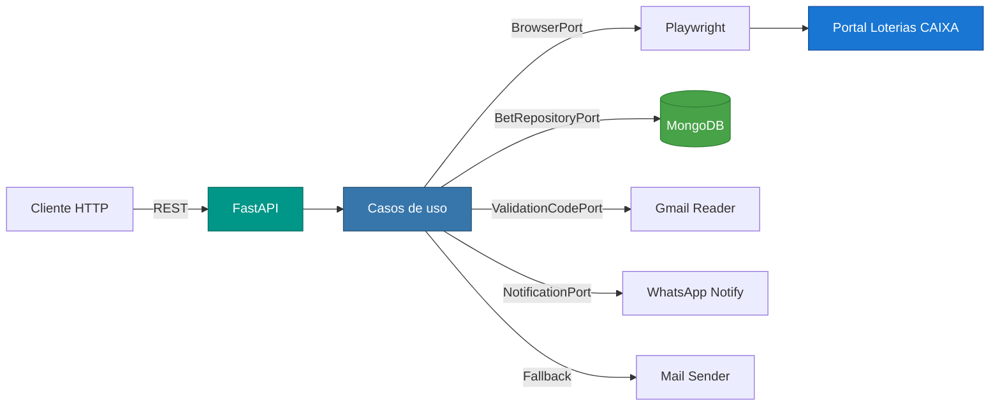
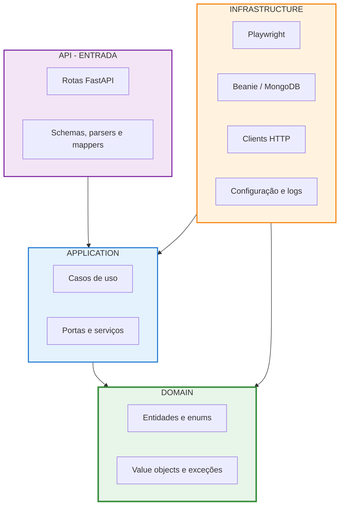
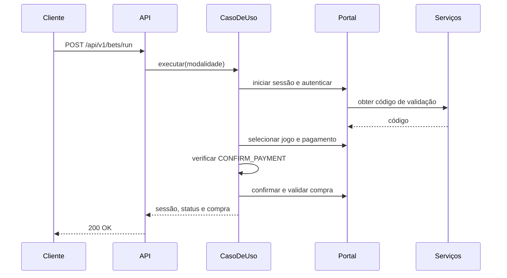

# LotoBot

<div align="center">


</div>

<div align="center">
  <p><strong>API REST para automatizar, de forma controlada e observável, apostas no portal Loterias Online CAIXA</strong></p>
  <p>
    <a href="#visão-geral">Visão Geral</a> •
    <a href="#arquitetura">Arquitetura</a> •
    <a href="#pré-requisitos">Pré-requisitos</a> •
    <a href="#quickstart">Quickstart</a> •
    <a href="#api-endpoints">API Endpoints</a> •
    <a href="#testes-e-qualidade">Testes</a> •
    <a href="#documentação">Documentação</a> •
    <a href="#monitoramento-e-observabilidade">Monitoramento</a>
  </p>
</div>

> O LotoBot controla uma sessão persistente do Chromium, executa o fluxo de aposta, consulta apostas do portal, persiste histórico opcionalmente e confere resultados com notificação por WhatsApp ou e-mail.

> [!CAUTION]
> A confirmação real do pagamento é bloqueada por padrão. Mantenha `CONFIRM_PAYMENT=false` durante desenvolvimento e testes. Nunca versione CPF, senha, CVV, dados de cartão, tokens ou códigos reais.

## Visão Geral

O LotoBot centraliza a automação do portal Loterias Online CAIXA atrás de uma API HTTP. O projeto usa Python 3.12, FastAPI e Playwright, com MongoDB opcional para o histórico de apostas.

### Principais características

- **Clean Architecture**: domínio e casos de uso independentes de FastAPI, Playwright, HTTP, PyMongo e Beanie.
- **Sessão persistente**: perfil do Chromium reutilizado entre operações.
- **Fluxo protegido**: pagamento real depende de autorização explícita por configuração.
- **Consulta ao vivo**: leitura das apostas exibidas na sessão autenticada do portal.
- **Persistência opcional**: histórico de apostas finalizadas em MongoDB.
- **Conferência de resultados**: correlação entre histórico e portal, com notificação consolidada.
- **Fallback de notificação**: WhatsApp como canal primário e e-mail como alternativa.
- **Validação acumulada**: erros estruturados com todos os campos ou parâmetros inválidos.
- **Documentação automática**: Swagger UI, ReDoc e OpenAPI.
- **Testes determinísticos**: fakes e `httpx.MockTransport`, sem Chromium ou acesso ao portal real.

### Arquitetura de comunicação



## Arquitetura

O projeto segue **Clean Architecture**, com dependências direcionadas para o domínio e contratos definidos por portas.



As regras são verificadas com `grimp`:

- `domain` não depende de `application`, `api` ou `infrastructure`;
- `application` não depende de `api` ou `infrastructure`;
- `infrastructure` não depende de `api`;
- `api` não acessa diretamente Playwright, PyMongo, Beanie ou clients HTTP;
- frameworks externos proibidos também são verificados por camada.

### Estrutura do projeto

```text
loto-bot/
├── src/
│   ├── api/                         # FastAPI, contratos e tratamento HTTP
│   ├── application/
│   │   ├── use_cases/               # Casos de uso
│   │   ├── ports/                   # Contratos de entrada e saída
│   │   ├── services/                # Serviços de aplicação
│   │   └── notification/            # Construção de notificações
│   ├── domain/                      # Entidades, enums, VOs e exceções
│   ├── infrastructure/
│   │   ├── browser/                 # Automação Playwright
│   │   ├── clients/                 # Gmail, e-mail e WhatsApp
│   │   ├── database/                # MongoDB, Beanie e repositórios
│   │   ├── selectors/               # Seletores centralizados do portal
│   │   ├── config/                  # Configuração do ambiente
│   │   └── logging/                 # Logging da aplicação
│   └── shared/                      # Utilitários compartilhados
├── tests/
│   ├── unit/                        # Testes unitários e de arquitetura
│   └── integration/                 # Testes dos contratos HTTP
├── .env.example                     # Modelo de configuração local
├── ARCHITECTURE.md                  # Decisões arquiteturais
├── DEVELOPMENT.md                   # Guia de desenvolvimento
└── pyproject.toml                   # Dependências e ferramentas
```

### Fluxo principal de aposta



Em caso de falha, o fluxo registra o erro, tenta notificar e encerra os recursos. Consulte [ARCHITECTURE.md](ARCHITECTURE.md) para mais detalhes.

## Pré-requisitos

| Requisito | Versão | Descrição |
|---|---:|---|
| Python | 3.12+ | Runtime da aplicação |
| pip | Atual | Instalação das dependências |
| Chromium | Compatível com Playwright | Navegador controlado pela automação |
| Git | Atual | Controle de versão |
| MongoDB | Compatível com o driver configurado | Opcional; usado quando a persistência está habilitada |
| Gmail Reader | Local | Obtém o código de validação |
| Mail Sender | Local | Fallback de notificação |
| WhatsApp Notify | Local | Canal primário quando habilitado |

## Quickstart

### Clone e instalação

```powershell
git clone <url-do-repositorio>
cd loto-bot

python -m venv .venv
.\.venv\Scripts\Activate.ps1
python -m pip install -e ".[dev]"
python -m playwright install chromium
```

### Configuração local

```powershell
Copy-Item .env.example .env
```

Preencha os placeholders apenas no ambiente local. Para uma primeira execução segura, mantenha:

```env
CONFIRM_PAYMENT=false
MONGODB_ENABLED=false
```

### Execução

```powershell
python -m uvicorn api.server:app --app-dir src --host 0.0.0.0 --port 8000 --reload
```

Ou:

```powershell
python src/main.py
```

**Acessos locais:**

- Health: <http://localhost:8000/health>
- Swagger UI: <http://localhost:8000/docs>
- ReDoc: <http://localhost:8000/redoc>
- OpenAPI: <http://localhost:8000/openapi.json>

## API Endpoints

| Método | Endpoint | Descrição | Dependência operacional |
|---|---|---|---|
| `GET` | `/health` | Verifica a disponibilidade | Nenhuma |
| `GET` | `/api/v1/sessions/start` | Inicia Chromium e tenta iniciar WhatsApp Web | Serviços configurados |
| `GET` | `/api/v1/sessions/stop` | Encerra Chromium e WhatsApp Web | Sessão aberta |
| `GET` | `/api/v1/sessions/status` | Consulta o estado da sessão | Nenhuma |
| `POST` | `/api/v1/bets/run` | Executa o fluxo completo de aposta | Portal e autenticação |
| `GET` | `/api/v1/bets` | Consulta apostas ao vivo no portal | Sessão autenticada |
| `POST` | `/api/v1/bets/check_draws` | Confere histórico e notifica | MongoDB e, se necessário, sessão aberta |
| `GET` | `/api/v1/history/bets` | Lista apostas persistidas | MongoDB habilitado |
| `GET` | `/api/v1/history/bets/{bet_id}` | Consulta uma aposta persistida | MongoDB habilitado |

### Exemplos de uso

<details>
<summary>Saúde e controle de sessão</summary>

```powershell
curl http://localhost:8000/health
curl http://localhost:8000/api/v1/sessions/start
curl http://localhost:8000/api/v1/sessions/status
curl http://localhost:8000/api/v1/sessions/stop
```

Resposta do health:

```json
{
  "status": "ok",
  "application": "LotoBot"
}
```
</details>

<details>
<summary>Executar o fluxo de aposta</summary>

Sem corpo, a API usa `SELECTED_LOTTERY_MODALITY`:

```powershell
curl -X POST http://localhost:8000/api/v1/bets/run
```

Com modalidade explícita:

```powershell
curl -X POST http://localhost:8000/api/v1/bets/run `
  -H "Content-Type: application/json" `
  -d '{"selected_lottery_modality":"MEGA_SENA"}'
```

```json
{
  "session_id": "00000000-0000-0000-0000-000000000001",
  "status": "Finalizada",
  "message": "Aposta finalizada com sucesso.",
  "executed_operation": "Completa a aposta",
  "purchase_number": "123456"
}
```
</details>

<details>
<summary>Consultar apostas ao vivo</summary>

A sessão deve estar aberta e autenticada. A rota não inicia, reinicia, encerra ou persiste dados automaticamente.

```powershell
curl "http://localhost:8000/api/v1/bets?bet_type=INDIVIDUAL&lottery_modality=MEGA_SENA&draw_type=NORMAL&month_year=LAST_7_DAYS&status=PAID&sort_by=DATE_DESC"
```

Filtros opcionais:

- `bet_type`: `ALL`, `INDIVIDUAL` ou `POOL`;
- `lottery_modality`: `ALL` ou uma modalidade suportada;
- `draw_type`: `ALL`, `NORMAL` ou `SPECIAL`;
- `month_year`: período relativo ou `YYYY-MM` dentro da janela aceita;
- `status`: `ALL`, `PAID` ou `EXPIRED`;
- `sort_by`: `DATE_ASC` ou `DATE_DESC`.

```json
[
  {
    "purchase_datetime": "2026-07-19T12:33:09-03:00",
    "lottery_modality": "MEGA_SENA",
    "selected_numbers": ["09", "18", "33", "40", "47", "53"],
    "draw_number": "3034",
    "status": "Aposta não premiada"
  }
]
```
</details>

<details>
<summary>Consultar o histórico persistido</summary>

```powershell
curl "http://localhost:8000/api/v1/history/bets?lottery_modality=MEGA_SENA&draw_number=1234&start_date=2026-07-01&end_date=2026-07-31"
curl http://localhost:8000/api/v1/history/bets/64ef8f7a6f9a8f0f8f0f8f0f
```

Filtros opcionais: `lottery_modality`, `draw_number`, `start_date` e `end_date`. Datas usam `YYYY-MM-DD`; o concurso deve ser maior que zero.
</details>

<details>
<summary>Conferir resultados e notificar</summary>

```powershell
curl -X POST http://localhost:8000/api/v1/bets/check_draws `
  -H "Content-Type: application/json" `
  -d '{"lottery_modality":"MEGA_SENA","start_date":"2026-07-27","end_date":"2026-07-27","bet_type":"INDIVIDUAL","draw_type":"ALL","month_year":"LAST_7_DAYS","status":"ALL"}'
```

Obrigatórios: `lottery_modality`, `start_date` e `end_date`. Opcionais: `bet_type`, `draw_type`, `month_year` e `status`. `sort_by` não faz parte desse contrato.

```json
{
  "matched_bets": 1,
  "notification_sent": true,
  "notification_channel": "WHATSAPP",
  "message": "Conferência concluída e notificação enviada pelo WhatsApp."
}
```

O histórico é consultado primeiro. Se estiver vazio, o portal não é acessado. Correspondências são reunidas em uma mensagem; o WhatsApp é tentado primeiro e o e-mail é o fallback. Se ambos falharem, a API retorna `503`.
</details>

### Regras de correlação

A conferência usa modalidade canônica, sequência posicional dos números e número textual do concurso. A ordem e os zeros à esquerda são preservados; situação e datas não participam da chave. Para `draw_type=SPECIAL`, o histórico usa a variante `_ESPECIAL` disponível, como `QUINA_ESPECIAL`.

### Respostas de erro

```json
{
  "error": {
    "timestamp": "2026-06-16T10:00:00-03:00",
    "status_code": 400,
    "code": "REQUISICAO_INVALIDA",
    "message": "Parâmetros inválidos",
    "details": [
      {
        "field": "lottery_modality",
        "rejected_value": "abc",
        "allowed_values": ["ALL", "MEGA_SENA", "QUINA"],
        "message": "Valor inválido."
      }
    ]
  }
}
```

O `timestamp` usa `America/Sao_Paulo`.

| Status | Situações |
|---:|---|
| `400` | Requisição, parâmetros, campos ou identificador inválidos |
| `403` | Confirmação de pagamento desabilitada |
| `404` | Rota não encontrada |
| `409` | Estado inválido da sessão ou aposta indisponível |
| `429` | Limite máximo diário de compras |
| `500` | Falha de automação ou erro interno |
| `502` | Erro de comunicação ou redirecionamento no portal |
| `503` | Serviço externo indisponível |

## Configuração

As configurações são carregadas do ambiente e do arquivo `.env` por `pydantic-settings`.

| Variável | Descrição | Padrão no código |
|---|---|---|
| `BETTOR_CPF` | CPF usado na autenticação | Placeholder |
| `BETTOR_PASSWORD` | Senha do apostador | Placeholder |
| `SELECTED_LOTTERY_MODALITY` | Modalidade padrão | `mega-sena` |
| `CONFIRM_PAYMENT` | Autoriza pagamento real | `false` |
| `BROWSER_PROFILE_DIR` | Perfil persistente do Chromium | `.lotobot-profile` |
| `BROWSER_HEADLESS` | Chromium sem interface | `true` |
| `BROWSER_TIMEOUT_SECONDS` | Timeout padrão do navegador | `5` |
| `MONGODB_ENABLED` | Habilita persistência | `false` |
| `MONGODB_URI` | URI do MongoDB | `mongodb://localhost:27017` |
| `MONGODB_DATABASE` | Banco da aplicação | `loto_bot` |
| `GMAIL_READER_URL` | Serviço do código de validação | `http://localhost:8001` |
| `MAIL_SENDER_URL` | Serviço de e-mail | `http://localhost:8002` |
| `WHATSAPP_NOTIFY_URL` | Serviço de WhatsApp | `http://localhost:8003` |
| `WHATSAPP_ENABLED` | Habilita o WhatsApp | `false` |
| `MAIL_TO` | Destinatário do fallback | Placeholder |

Consulte [.env.example](.env.example) para a lista completa.

Para habilitar o histórico:

```env
MONGODB_ENABLED=true
MONGODB_URI=mongodb://localhost:27017
MONGODB_DATABASE=loto_bot
```

`BROWSER_PROFILE_DIR` é criado automaticamente. Caminhos relativos são resolvidos a partir da raiz do projeto. Booleanos aceitam `true/false`, `yes/no`, `sim/não` e `1/0`.

## Testes e Qualidade

```powershell
python -m pytest
python -m pytest --cov=src --cov-report=term-missing
python -m pytest tests/unit/test_architecture.py
```

Os testes não abrem o Chromium nem acessam `ONLINE_LOTTERY_URL`. A cobertura mínima configurada é de **100%**, descontados os módulos omitidos em `pyproject.toml`.

Formatação e lint:

```powershell
python -m ruff format src tests
python -m ruff check --fix src tests
```

O Ruff usa Python alvo `py312`, largura de 120 caracteres e regras para erros, imports, modernização, bugs e simplificações.

## Documentação

| Recurso | Local |
|---|---|
| Swagger UI | <http://localhost:8000/docs> |
| ReDoc | <http://localhost:8000/redoc> |
| OpenAPI JSON | <http://localhost:8000/openapi.json> |
| Arquitetura | [ARCHITECTURE.md](ARCHITECTURE.md) |
| Desenvolvimento | [DEVELOPMENT.md](DEVELOPMENT.md) |

## Monitoramento e Observabilidade

| Endpoint | Descrição | URL local |
|---|---|---|
| Health | Disponibilidade da aplicação | <http://localhost:8000/health> |

- O nível de log é definido por `LOG_LEVEL`.
- Eventos registram operação, processo e thread.
- Dados sensíveis devem permanecer mascarados.
- Falhas operacionais geram tentativa de notificação.

Exemplo de probes:

```yaml
livenessProbe:
  httpGet:
    path: /health
    port: 8000
  initialDelaySeconds: 10
  periodSeconds: 10

readinessProbe:
  httpGet:
    path: /health
    port: 8000
  initialDelaySeconds: 5
  periodSeconds: 5
```

## Segurança

- Nunca versione `.env` nem credenciais reais.
- Mantenha `CONFIRM_PAYMENT=false` em desenvolvimento e CI.
- Não registre CPF, senha, CVV, código de validação ou cartão.
- Use conta e ambiente controlados para validar a automação.
- Revise seletores antes de autorizar qualquer pagamento.
- Não execute testes automatizados contra o portal real.

## Contribuição

1. Preserve as dependências da Clean Architecture.
2. Não coloque regras de negócio em handlers FastAPI.
3. Mantenha seletores em `infrastructure/selectors`.
4. Atualize README, OpenAPI e exemplos ao alterar contratos.
5. Inclua testes para cada comportamento alterado.
6. Use Conventional Commits: `feat:`, `fix:`, `docs:`, `refactor:` e `test:`.

### Antes de submeter um Pull Request

- [ ] Todos os testes passam.
- [ ] A cobertura permanece em 100% no escopo configurado.
- [ ] Ruff não encontra violações.
- [ ] Nenhum segredo ou dado pessoal foi incluído.
- [ ] Contratos REST e exemplos foram revisados.
- [ ] A confirmação de pagamento continua segura por padrão.

```powershell
python -m ruff format --check src tests
python -m ruff check src tests
python -m pytest --cov=src --cov-report=term-missing
```

## Troubleshooting

<details>
<summary>Chromium não está instalado</summary>

```powershell
python -m playwright install chromium
```
</details>

<details>
<summary>Porta 8000 em uso</summary>

```powershell
Get-NetTCPConnection -LocalPort 8000
python -m uvicorn api.server:app --app-dir src --port 8001
```
</details>

<details>
<summary>Sessão já aberta ou fechada</summary>

```powershell
curl http://localhost:8000/api/v1/sessions/status
```
</details>

<details>
<summary>Pagamento retorna 403</summary>

Esse é o comportamento seguro quando `CONFIRM_PAYMENT=false`. Somente altere a variável após revisar o ambiente, os dados e a aposta.
</details>

<details>
<summary>Histórico indisponível</summary>

Verifique se o MongoDB está acessível e se `MONGODB_ENABLED`, `MONGODB_URI` e `MONGODB_DATABASE` estão consistentes.
</details>

<details>
<summary>Falha no código de validação ou nas notificações</summary>

Confirme se os serviços estão ativos nas URLs definidas por `GMAIL_READER_URL`, `WHATSAPP_NOTIFY_URL` e `MAIL_SENDER_URL`.
</details>

<details>
<summary>Falha após mudança no portal</summary>

Use `LOG_LEVEL=DEBUG`, inspecione o ponto da falha e revise `src/infrastructure/selectors`. Não habilite o pagamento enquanto o fluxo não estiver validado.
</details>
